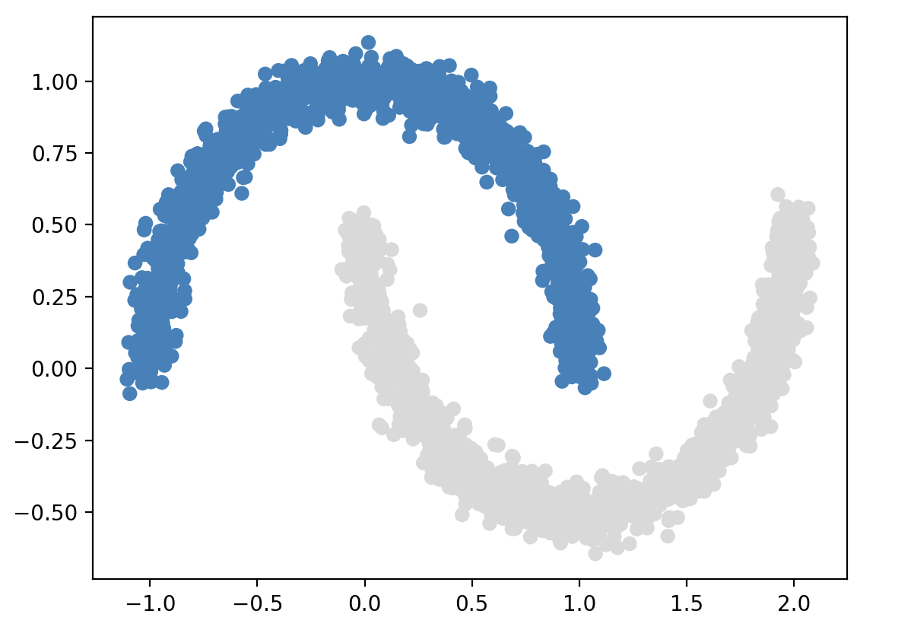

# VoroClust

This is the code repository for the clustering algorithm introduced in [VoroClust: Scalable Clustering for Remote Sensing](https://ieeexplore.ieee.org/abstract/document/11489482).

VoroClust is a scalable, density-based clustering algorithm that leverages sphere covers to accurately model the geometric structure of clusters.  The algorithm has one primary parameter, the radius `R` used to construct the sphere cover, and three auxiliary parameters: `detail_ceiling`, `descent_limit`, and `noise_threshold`.  The detail ceiling helps avoid breaking up clusters in high-density regions (e.g., triggered by false peaks due to noise in the empirical density estimates). The descent limit prevents clusters from expanding too far into low density regions, where outliers and anomalies may be present.  Finally, the noise threshold parameter can be specified to adjust the percentage of data that is declared noise.


## Installation

First, download the source code from the repository:
```console
$ git clone https://github.com/sandialabs/VoroClust.git
```

Change into the Python source directory, and install using pip:
```console
$ cd ./VoroClust/python
$ python -m pip install .
```

#### Note for Linux HPC Systems
If you encounter the error `Directory not empty: build/bdist.linux-x86_64/wheel/voroclust` during installation, it is possible that the temporary file directory needs to be adjusted to a location on the local drive.  This can be done by creating a directory `mkdir ./tmp` and setting the environment variable `export TMPDIR=<path_to_tmp_dir>` before installing with pip.


## Example Usage

```python
from voroclust import VoroClust
import numpy as np
import matplotlib.pyplot as plt

# Specify algorithm hyperparameters
R = 0.25
detail_ceiling = 0.8
descent_limit = 0.1
NUM_THREADS = 8


# Specify optional post-processing options
noise_style = "Assign Noise"    # or "Prune Clusters" with 'max_clusters' set
max_clusters = None
noise_threshold = 0.05

# Load input data
data = np.load("./dataset/BasicClusteringTest/moons.npy")

# Initialize clustering model
model = VoroClust(data,
                  radius=R,
                  detail_ceiling=detail_ceiling,
                  descent_limit=descent_limit,
                  num_threads=NUM_THREADS)

#
#  Note: filenames can also be provided directly to VoroClust 
#        model = VoroClust(data_filename="./dataset/BasicClusteringTest/noisy_moons.csv", ... )
#

# Fit clustering model to data
cluster_vals, labels, noise_indices = model.fit(noise_style=noise_style,
                                                max_clusters=max_clusters,
                                                noise_threshold=noise_threshold)

# Plot results
data = model.input_data
plt.scatter(data[:,0], data[:,1], c=cluster_vals)
plt.show()
```


## Example Problems

A collection of simple test problems are provided in the [./tests/](./tests/) directory for reference.

<p align="center">
  
  
</p>


## C++ Installation
----- Step 1 -----

To build the VoroClust executable:

```
mkdir build
cd build
cmake ..
make
```


----- Step 2 ----- 

To install the VoroClust python package, navigate to the python folder and run:

python -m pip install .

With Python 3.10+, it should (temporarily) install any missing dependencies
then build and install the voroclust package.

If this fails, you can install manual dependencies with...

----- Step 3 (optional) -----

```
pip install setuptools
pip install wheel
pip install "pybind11[global]"
pip install ninja
pip install cmake
```


----- Step 4 (troubleshooting) -----

If step 2 is still failing, it might be because CMake is failing to find the pybind11 dependency.
This error looks like:

      CMake Error at CMakeLists.txt:26 (find_package):
        Could not find a package configuration file provided by "pybind11" with any
        of the following names:

          pybind11Config.cmake
          pybind11-config.cmake

        Add the installation prefix of "pybind11" to CMAKE_PREFIX_PATH or set
        "pybind11_DIR" to a directory containing one of the above files.  If
        "pybind11" provides a separate development package or SDK, be sure it has
        been installed.

You can locate the pybind11 python install with the command: 

python -m pip show pybind11

Within that directory, navigate to pybind11/share/cmake/pybind11, where it should have the file pybind11Config.cmake.
You can tell CMake exactly where this is by setting the pybind11_DIR variable in python/CMakeLists.txt:

set(pybind11_DIR "path/to/pybind11Config.cmake")


## How to cite VoroClust

If you find this code useful, please cite this work using the BibTeX entry below:
```
@article{winovich2026voroclust,
  title={VoroClust: Scalable Clustering for Remote Sensing},
  author={Winovich, Nick and Moynihan, Liam and Abdelrahman, Osama and West, R Derek and Dauphin, Stephen and Tucker, J Derek and Huerta, Gabriel and Potter, Kevin and Forrest, Robert and Phillips, Cynthia and others},
  journal={IEEE Journal of Selected Topics in Applied Earth Observations and Remote Sensing},
  year={2026},
  publisher={IEEE}
}
```


